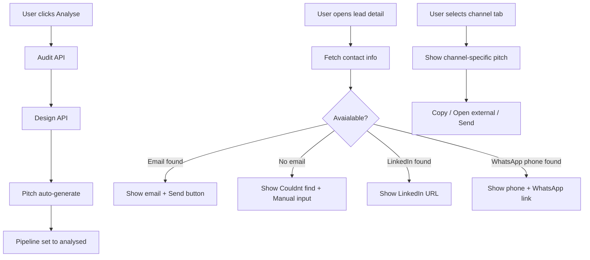

# Opportunity Detail Page — Additional Features Plan

## Overview
Four additional features requested after the initial page hierarchy refactoring. These are additive — the existing layout and design system remain unchanged.

---

## Feature 1: Pipeline Status Consolidation

### Problem
Since the full analysis (`handleFullAnalysis`) already auto-generates the pitch, the "pitch_generated" pipeline status is redundant. Analysing a lead effectively means "analysed + pitch ready."

### Changes

**a) [`src/lib/ui-constants.ts`](src/lib/ui-constants.ts)**
- Remove `pitch_generated` entry from `PIPELINE_LABELS`, `PIPELINE_BADGE_STYLES`, `PIPELINE_BAR_COLORS`, `PIPELINE_TEXT_COLORS`

**b) [`docs/SCHEMA.md`](docs/SCHEMA.md) §3.2 — Pipeline enum**
- Remove `| "pitch_generated"` from the PipelineStatus type

**c) Database constraint change** (run migration)
```sql
alter table public.pipeline drop constraint if exists pipeline_status_check;
alter table public.pipeline add constraint pipeline_status_check check (status in (
  'new_lead','analysed','contacted','in_conversation','won','lost'));
```

**d) [`src/app/dashboard/leads/[id]/lead-detail-client.tsx`](src/app/dashboard/leads/[id]/lead-detail-client.tsx)**
- In `handleRunAudit`: change `status: "analysed"` remains correct
- In `handleFullAnalysis`: after successful completion, update pipeline to `"analysed"` if currently `"new_lead"` (fire-and-forget, like pitch auto-generation)

---

## Feature 2: Channel-Specific Outreach

### Problem
The `/api/pitch` endpoint only generates email-style outreach (subject + body). For LinkedIn DM and WhatsApp, different formats and lengths are needed.

### Changes

**a) [`src/app/api/pitch/route.ts`](src/app/api/pitch/route.ts)**

Add `channel` parameter to `PitchRequestBody`:
```ts
type OutreachChannel = "email" | "linkedin" | "whatsapp";
```

Modify prompt generation based on channel:

| Channel | Format | Max length | Structure |
|---------|--------|------------|-----------|
| `email` | subject + body | 150 words | Current format (unchanged) |
| `linkedin` | body only (DM) | 100 words | Conversational, no subject, mention mutual connection angle |
| `whatsapp` | body only | 60 words | Very short, conversational, no formatting |

The response `ParsedPitch` already has `{ subject, body }`. For LinkedIn/WhatsApp, the `subject` field can be empty/null or contain a short preview line.

Add channel-specific prompt instructions to the Gemini prompt builder.

**b) Persist channel in `pitches` table**
Add a `channel` column:
```sql
alter table public.pitches add column if not exists channel text default 'email';
```

Update [`docs/SCHEMA.md`](docs/SCHEMA.md) §2.8 pitches table definition to include `channel`.

---

## Feature 3: Contact Detail Availability

### Problem
When the user selects a channel (Email/LinkedIn/WhatsApp), we need to show whether we have contact details for that channel.

### Current Data Available

| Channel | Data Source | Currently Available? |
|---------|-------------|---------------------|
| Email | Website scraping | ❌ Not stored |
| LinkedIn | Website scraping | ❌ Not stored |
| WhatsApp | `businesses.phone` field from Google Places | ✅ Already in DB |

### Implementation

**a) New API: `GET /api/contact-info?businessId=xxx`**

This endpoint:
1. Returns the existing `phone` field from `businesses` immediately (for WhatsApp)
2. For email: attempts to scrape the website for mailto links or email patterns
3. For LinkedIn: checks the website for LinkedIn profile/company URLs
4. Returns `{ email: string | null, linkedin: string | null, phone: string | null }`

**Scraping logic** (lightweight, no external service):
- Fetch the website HTML server-side
- Regex for `mailto:` links and email patterns
- Regex for linkedin.com URLs
- Cache result in a new `contact_info` JSONB column on `businesses`

```sql
alter table public.businesses add column if not exists contact_info jsonb default '{}';
```

Contact info shape:
```json
{
  "email": "contact@example.com" | null,
  "linkedin": "https://linkedin.com/in/company" | null,
  "phone": "+1234567890" | null,
  "scraped_at": "2026-06-02T00:00:00Z"
}
```

**b) Cache strategy**
- Scrape once per business
- Cache in `businesses.contact_info` column
- Re-scrape after 30 days (threshold stored as `scraped_at`)
- Site fetch timeout: 5 seconds

---

## Feature 4: UI Integration for Contact Status + Channel Outreach

### Changes to [`lead-detail-client.tsx`](src/app/dashboard/leads/[id]/lead-detail-client.tsx)

**a) New state:**
```ts
const [contactInfo, setContactInfo] = useState<{
  email: string | null;
  linkedin: string | null;
  phone: string | null;
  loading: boolean;
}>({ email: null, linkedin: null, phone: null, loading: true });
```

**b) Fetch contact info on mount** (via new API)

**c) Per-channel UI changes in "Ready-to-Send Outreach" section:**

| Channel | If contact found | If not found |
|---------|-----------------|--------------|
| Email | Show email address + "Send via email" button | Show "Couldn't find email" + "Paste manually" textarea |
| LinkedIn DM | Show LinkedIn URL + "Open LinkedIn" button | Show "Couldn't find LinkedIn profile" |
| WhatsApp | Show phone number + "Open WhatsApp" button | Show "Couldn't find phone number" |

**d) Channel tab badge:**
- Show a green dot next to channel name if contact info available
- Show a gray dot if not found

**e) Existing pitch/generation logic stays unchanged** — the pitch text is generated regardless; the contact availability just determines the action button (copy vs. open external link).

---

## Implementation Order

1. **Phase 1** — Pipeline consolidation (small change, no new API)
   - [`src/lib/ui-constants.ts`](src/lib/ui-constants.ts): remove `pitch_generated`
   - DB migration: drop constraint, re-add without `pitch_generated`
   - [`lead-detail-client.tsx`](src/app/dashboard/leads/[id]/lead-detail-client.tsx): update pipeline auto-set in `handleFullAnalysis`

2. **Phase 2** — Channel-specific prompts
   - [`src/app/api/pitch/route.ts`](src/app/api/pitch/route.ts): add `channel` parameter, modify prompts
   - DB migration: add `channel` column to `pitches`
   - [`docs/SCHEMA.md`](docs/SCHEMA.md): update

3. **Phase 3** — Contact info scraping
   - New API: `src/app/api/contact-info/route.ts`
   - DB migration: add `contact_info` JSONB column to `businesses`
   - [`docs/SCHEMA.md`](docs/SCHEMA.md): update

4. **Phase 4** — UI integration
   - [`lead-detail-client.tsx`](src/app/dashboard/leads/[id]/lead-detail-client.tsx): fetch contact info, display per-channel, wire action buttons
   - Status indicators on channel tabs

---

## Files to Modify

| File | Phase | Change |
|------|-------|--------|
| [`src/lib/ui-constants.ts`](src/lib/ui-constants.ts) | 1 | Remove pitch_generated entries |
| [`src/app/dashboard/leads/[id]/lead-detail-client.tsx`](src/app/dashboard/leads/[id]/lead-detail-client.tsx) | 1, 4 | Pipeline auto-update + contact UI |
| [`src/app/api/pitch/route.ts`](src/app/api/pitch/route.ts) | 2 | Channel-specific prompts |
| [`src/app/api/contact-info/route.ts`](src/app/api/contact-info/route.ts) | 3 | New endpoint |
| [`docs/SCHEMA.md`](docs/SCHEMA.md) | 1, 2, 3 | Schema updates |
| Database (via migration) | 1, 2, 3 | ALTER TABLE statements |

## Files to Create

| File | Phase | Purpose |
|------|-------|---------|
| [`src/app/api/contact-info/route.ts`](src/app/api/contact-info/route.ts) | 3 | Scrape and return contact info |

---

## Mermaid: Data Flow


