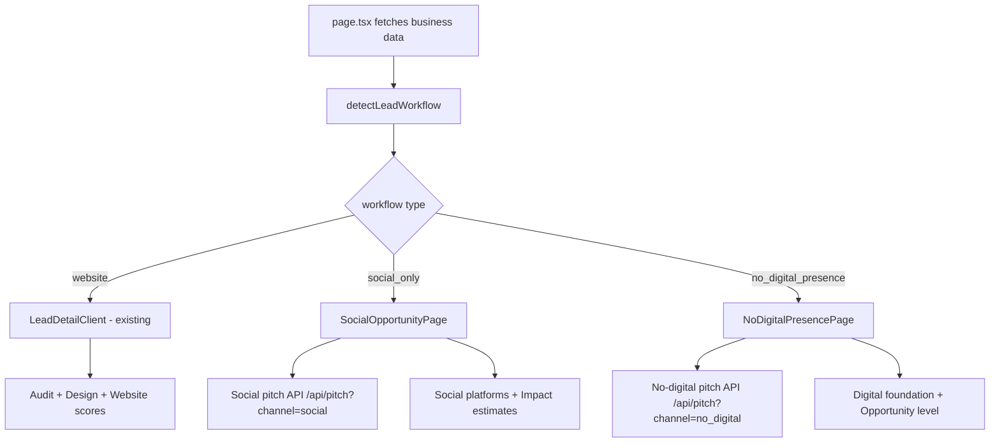

# Three-Workflow Opportunity Detail Architecture

## Current State
- [`lead-detail-client.tsx`](src/app/dashboard/leads/[id]/lead-detail-client.tsx) is a single ~1445-line component
- [`businesses.website_status`](docs/SCHEMA.md:76) already classifies: `has_website`, `no_website`, `social_only`, `platform_only`, `unknown`
- Lead routing happens via the [`page.tsx`](src/app/dashboard/leads/[id]/page.tsx) server component which passes props blindly

## Proposed Architecture

### 1. Lead Type Detection Layer

Create [`src/lib/lead-types.ts`](src/lib/lead-types.ts):

```ts
export type LeadWorkflow = "website" | "social_only" | "no_digital_presence";

export function detectLeadWorkflow(business: {
  website_status: string;
  website: string | null;
}): LeadWorkflow {
  switch (business.website_status) {
    case "has_website":
    case "platform_only":
      return "website";
    case "social_only":
      return "social_only";
    case "no_website":
    case "unknown":
    default:
      return "no_digital_presence";
  }
}

export function detectSocialPlatforms(website: string | null): string[] {
  if (!website) return [];
  const url = website.toLowerCase();
  const platforms: string[] = [];
  if (url.includes("facebook.com") || url.includes("fb.com")) platforms.push("Facebook");
  if (url.includes("instagram.com")) platforms.push("Instagram");
  if (url.includes("tiktok.com")) platforms.push("TikTok");
  if (url.includes("linkedin.com")) platforms.push("LinkedIn");
  if (url.includes("youtube.com") || url.includes("youtu.be")) platforms.push("YouTube");
  if (url.includes("x.com") || url.includes("twitter.com")) platforms.push("X / Twitter");
  if (url.includes("wa.me") || url.includes("whatsapp")) platforms.push("WhatsApp");
  return platforms;
}
```

### 2. Component Architecture

```
src/app/dashboard/leads/[id]/
├── page.tsx                         ← Server component: fetches data, detects workflow, routes
├── lead-detail-client.tsx           ← Kept as-is (current refactored Website workflow)
├── components/
│   ├── SocialOpportunityPage.tsx     ← NEW: Workflow for social_only leads
│   ├── NoDigitalPresencePage.tsx     ← NEW: Workflow for no_website leads
│   └── shared/
│       ├── HeroSection.tsx          ← Shared: business name, location, actions
│       ├── OutreachSection.tsx      ← Shared: channel tabs, pitch gen, contact info
│       └── ClientCallSummary.tsx    ← Shared: summary card
```

### 3. Page Routing Logic

Update [`page.tsx`](src/app/dashboard/leads/[id]/page.tsx):

```tsx
// After fetching business data, detect workflow
const workflow = detectLeadWorkflow(business);
return (
  <LeadWorkflowRouter
    business={business}
    audits={audits}
    designAnalyses={designRows}
    pipelineStatus={pipelineRow?.status}
    workflow={workflow}
  />
);
```

Create [`LeadWorkflowRouter`](src/app/dashboard/leads/[id]/lead-workflow-router.tsx):

```tsx
switch (workflow) {
  case "website":    return <LeadDetailClient {...props} />;
  case "social_only": return <SocialOpportunityPage {...props} />;
  case "no_digital_presence": return <NoDigitalPresencePage {...props} />;
}
```

### 4. Data Flow



### 5. What Each Component Renders

#### WebsiteOpportunityPage (current `lead-detail-client.tsx`)
- Keep current refactored layout with all 8 sections
- No changes needed

#### SocialOpportunityPage (NEW)
```
1. HERO
   - Business Name (clamp typography)
   - Industry, Location
   - Detected Social Platforms (badges: Instagram, Facebook, etc.)
   - Badge: "Social Presence Detected"
   - Pipeline status / Add to Pipeline

2. DIGITAL PRESENCE CARD
   - "Digital Presence Analysis" title
   - Per-platform: Instagram Present, Facebook Present
   - Website Missing
   - Potential Opportunity: High

3. WHY THIS IS AN OPPORTUNITY
   - Generated bullets (no website, search visibility limited, etc.)

4. WEBSITE OPPORTUNITY IMPACT
   - Impact estimates: Trust +++, Lead Capture +++, Search Visibility ++, Brand Control +++

5. READY-TO-SEND OUTREACH (primary feature, moved up)
   - Tabs: WhatsApp, Instagram DM, Facebook Message, Email (if exists)
   - Hide unavailable channels
   - Pitch generation references social platforms, not audit scores

6. CLIENT CALL SUMMARY
   - Concise format adapted for social-only businesses

7. EXPORT
   - PDF + Share Link
```

#### NoDigitalPresencePage (NEW)
```
1. HERO
   - Business Name, Industry, Location
   - Phone Number (if available)
   - Badge: "No Digital Presence Found"

2. WHY THIS IS AN OPPORTUNITY
   - No website, no social, limited discoverability

3. DIGITAL FOUNDATION CARD
   - Recommended: 1. Professional Website, 2. Google Business, 3. Social Profiles, 4. Contact Funnel
   - Opportunity Level: Very High

4. READY-TO-SEND OUTREACH (primary feature)
   - Tabs: WhatsApp, SMS, Phone Script
   - Only available channels

5. CLIENT CALL SUMMARY
   - Focused on visibility, credibility, lead generation

6. EXPORT
```

### 6. Pitch API Changes

Update [`pitch/route.ts`](src/app/api/pitch/route.ts):

The `channelInstruction` function already supports `"email"` and `"whatsapp"`. We need to add:
- **Social workflow prompt**: Reference detected social platforms, never mention audits/scores
- **No-digital workflow prompt**: Focus on visibility, credibility, never mention audits/scores

The channel enum stays `"email" | "whatsapp"`. The workflow context (detected social platforms, lead type) is passed in the request body and the prompt adapts accordingly.

### 7. Database

No schema changes needed initially:
- `website_status` already classifies all three types
- `businesses.phone` already stores contact number
- Social platforms can be detected from the `website` field at render time
- If social detection needs to be cached later, add a `social_platforms` JSONB column

### 8. Pitch API Social Workflow Support

Add a `workflow` field to the pitch request:

```ts
type PitchRequestBody = {
  ...
  workflow?: "website" | "social_only" | "no_digital_presence";
  socialPlatforms?: string[];
};
```

When `workflow === "social_only"`:
- Prompt references social platforms found
- Never mentions audits, scores, or website performance
- Focus: "Your Instagram and Facebook presence is strong. Here's what a website could add..."

When `workflow === "no_digital_presence"`:
- Prompt focuses on visibility gap
- Never mentions audits or website issues
- Focus: "Limited online presence means customers may not find you..."

### 9. Implementation Order

1. Create [`src/lib/lead-types.ts`](src/lib/lead-types.ts) — detection utilities
2. Create [`src/app/dashboard/leads/[id]/lead-workflow-router.tsx`](src/app/dashboard/leads/[id]/lead-workflow-router.tsx) — routing component
3. Update [`page.tsx`](src/app/dashboard/leads/[id]/page.tsx) — detect workflow, pass to router
4. Extract shared components: [`HeroSection.tsx`](src/app/dashboard/leads/[id]/components/shared/HeroSection.tsx), [`OutreachSection.tsx`](src/app/dashboard/leads/[id]/components/shared/OutreachSection.tsx), [`ClientCallSummary.tsx`](src/app/dashboard/leads/[id]/components/shared/ClientCallSummary.tsx)
5. Create [`SocialOpportunityPage.tsx`](src/app/dashboard/leads/[id]/components/SocialOpportunityPage.tsx)
6. Create [`NoDigitalPresencePage.tsx`](src/app/dashboard/leads/[id]/components/NoDigitalPresencePage.tsx)
7. Update [`pitch/route.ts`](src/app/api/pitch/route.ts) — workflow-aware prompts
8. Move current [`lead-detail-client.tsx`](src/app/dashboard/leads/[id]/lead-detail-client.tsx) → components/WebsiteOpportunityPage.tsx
